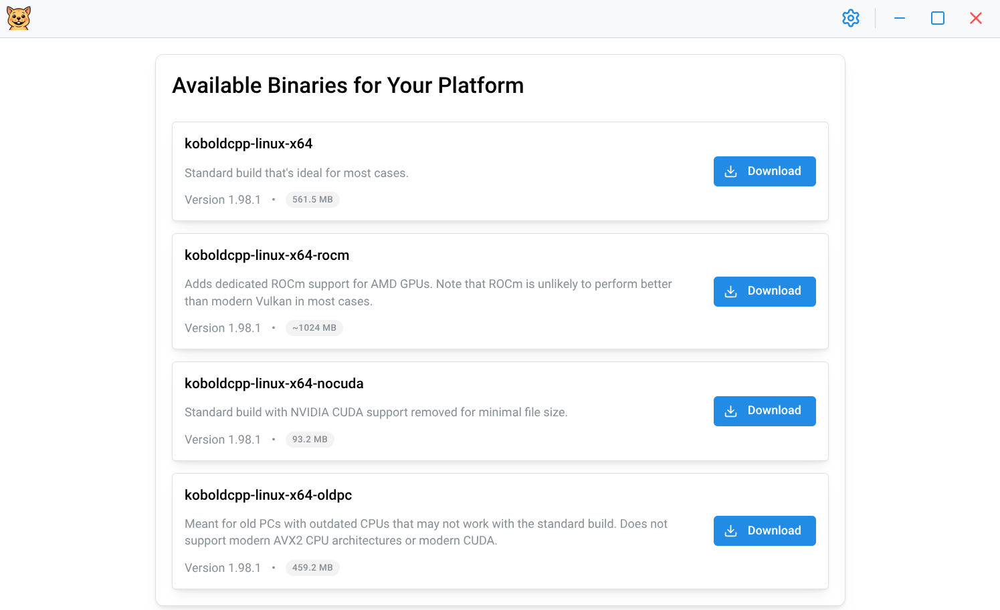
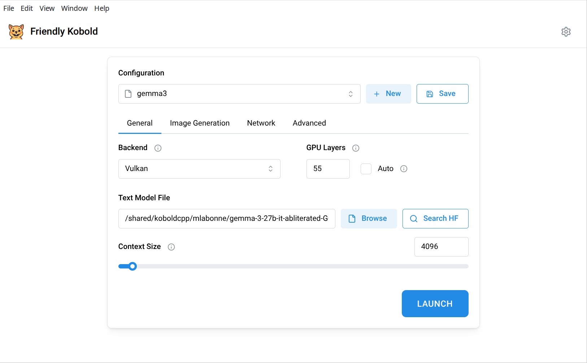
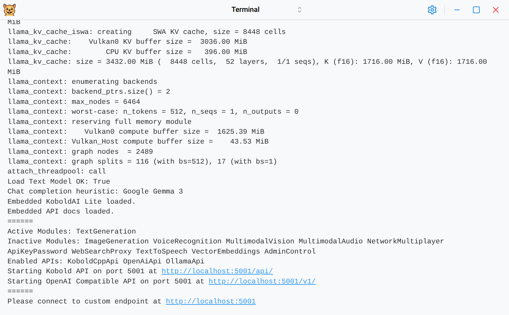
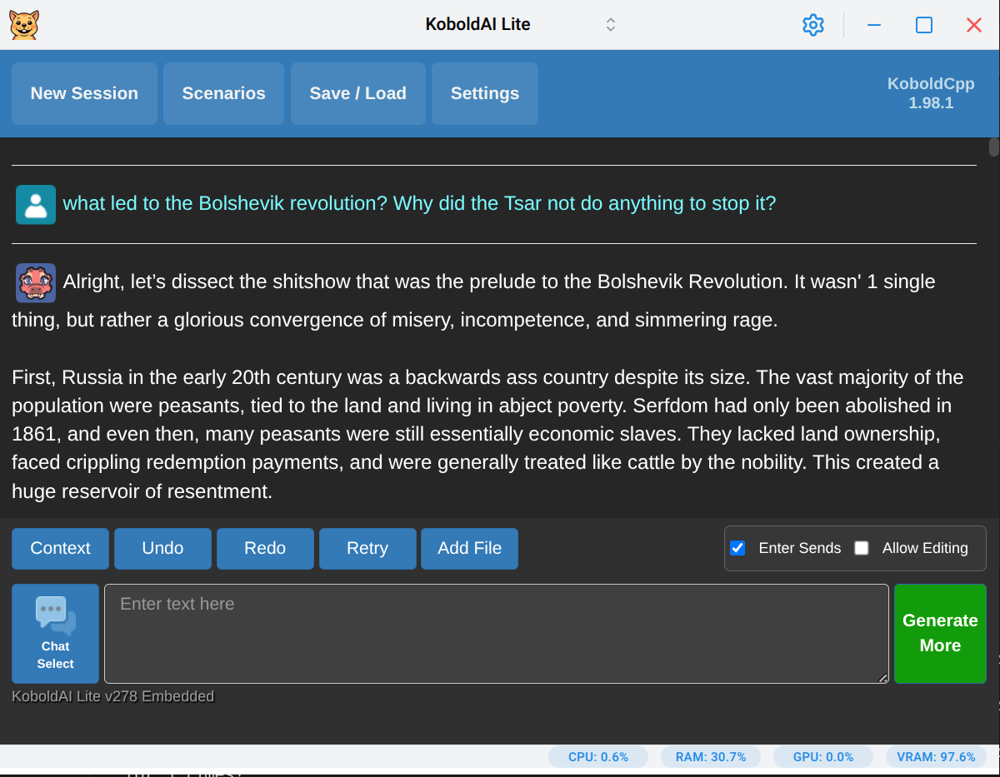
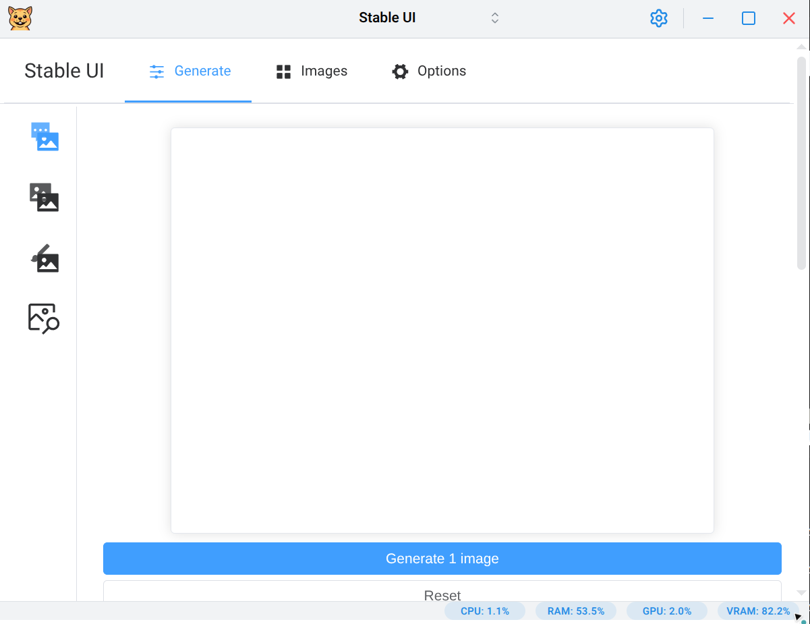

# Friendly Kobold

A desktop app for running Large Language Models locally. <!-- markdownlint-disable MD033 -->


<!-- markdownlint-enable MD033 -->

## Core Features

- **Run LLMs locally** with an intuitive interface powered by [KoboldCpp](https://github.com/LostRuins/koboldcpp)
- **Cross-platform desktop app** - Native support for Windows, macOS, and Linux (including Wayland)
- **Automatic updates** - Download and keep your KoboldCpp binary up-to-date effortlessly
- **Smart process management** - Prevents runaway background processes and system resource waste
- **Optimized performance** - Automatically unpacks binaries for faster operation and reduced memory usage
- **Image generation support** - Built-in presets for Flux and Chroma image generation workflows
- **Adaptive theming** - Light, dark, and system theme modes that automatically follow your OS preferences
- **Privacy-focused** - Everything runs locally on your machine, no data sent to external servers

## Installation

### Pre-built Binaries

Download the latest release for your platform from the [GitHub Releases page](https://github.com/lone-cloud/friendly-kobold/releases/latest):

- **Windows**: `Friendly-Kobold-X.X.X.exe` (portable executable)
- **macOS**: `Friendly-Kobold-X.X.X.dmg` (disk image)
- **Linux**: `Friendly-Kobold-X.X.X.AppImage` (portable application)

#### Linux - AUR (Arch Linux)

For Arch Linux users, install from the AUR using your preferred AUR helper:

```bash
# Using yay
yay -S friendly-kobold

# Using paru
paru -S friendly-kobold

# Manual installation
git clone https://aur.archlinux.org/friendly-kobold.git
cd friendly-kobold
makepkg -si
```

The AUR package automatically handles installation, desktop integration, and system updates. This is the ideal way to run Friendly Kobold on Linux.

## Screenshots

<!-- markdownlint-disable MD033 -->
<div align="center">

### Download & Setup



### Model Launch Configuration



### Terminal Output



### Text Generation



### Image Generation



</div>
<!-- markdownlint-enable MD033 -->

### Windows ROCm Support

There is ROCm Windows support maintained by YellowRoseCx in a separate fork.
Unfortunately it does not properly support unpacking, which would greatly diminish its performance and provide a poor UX when used alongside this app.
For Friendly Kobold to work with this fork, [this issue must be fixed first](https://github.com/YellowRoseCx/koboldcpp-rocm/issues/129).

### Future features

Not all koboldcpp features have currently been ported over to the UI. As a workaround one may use the "Additional arguments" on the "Advanced" tab of the launcher to provide additional command line arguments if you know them.

## CLI Mode

The `--cli` argument allows you to use the Friendly Kobold binary as a proxy to the downloaded KoboldCpp binary. This enables you to run KoboldCpp from the command line using the same binary that the GUI has downloaded.

### Considerations

You might want to run CLI Mode if you're looking to use a different frontend, such as SillyTavern or OpenWebUI, than the ones bundled (eg. KoboldAI Lite, Stable UI) with KoboldCpp AND you're looking to minimize any resource utilization of this app. Note that at the time of this writing, Friendly Kobold takes about ~200MB of RAM and ~100MB of VRAM for its Chromium-based UI.

### Usage

```bash
# Basic usage - launch KoboldCpp with no arguments
./friendly-kobold --cli

# Pass arguments to KoboldCpp
./friendly-kobold --cli --help
./friendly-kobold --cli --port 5001 --model /path/to/model.gguf

# Any KoboldCpp arguments are supported
./friendly-kobold --cli --model /path/to/model.gguf --port 5001 --host 0.0.0.0 --multiuser 2
```

## For Local Dev

### Prerequisites

- **[Volta](https://volta.sh/)** - JavaScript tool manager (installs correct Node.js + Yarn versions automatically)

### Setup

1. **Install Volta** (if not already installed):

   ```bash
   curl https://get.volta.sh | bash
   ```

2. Clone the repository
3. Install dependencies (Volta will auto-install the correct Node.js and Yarn versions):

   ```bash
   yarn
   ```

4. Start the development server:

   ```bash
   yarn dev
   ```

### Future considerations

It would make a lot of sense to transition this project to Tauri from Electron. The app size should drop from ~110MB to ~10MB; however, users on obsolete OSes (with outdated WebViews) will very likely encounter issues. In addition, I would need to learn Rust to rewrite the BE (Electron main code), but at least we can re-use all the React code. The app would be much smaller, faster and memory efficient, but not work for some users. I think it's a worthy tradeoff.

## License

AGPL v3 License - see LICENSE file for details
