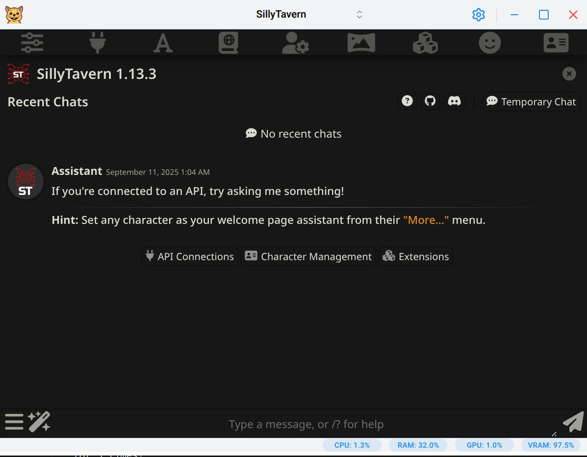

# Gerbil

A desktop app to easily run Large Language Models locally.


<!-- markdownlint-enable MD033 -->

## Core Features

- **Run LLMs locally** powered by [KoboldCpp](https://github.com/LostRuins/koboldcpp)
- **Cross-platform desktop app** - Native support for Windows, macOS, and Linux (including Wayland)
- **Automatic updates** - Download and keep your KoboldCpp binary up-to-date effortlessly
- **Smart process management** - Prevents runaway background processes and system resource waste
- **Optimized performance** - Automatically unpacks binaries for faster operation and reduced memory usage
- **Image generation support** - Built-in presets for Flux and Chroma image generation workflows
- **SillyTavern integration** - Seamlessly launch SillyTavern for advanced character interactions (requires [Node.js](https://nodejs.org/))
- **Privacy-focused** - Everything runs locally on your machine, no data sent to external servers

## Installation

### Pre-built Binaries

Download the latest release for your platform from the [GitHub Releases page](https://github.com/lone-cloud/gerbil/releases/latest):

- **Windows**: `Gerbil-Portable-X.X.X.exe` (portable executable)
- **Windows**: `Gerbil-Setup-X.X.X.exe` (installer executable)
- **macOS**: `Gerbil-X.X.X.dmg` (disk image)
- **Linux**: `Gerbil-X.X.X.AppImage` (portable application)

#### Linux - AUR (Arch Linux)

For Arch Linux users, install from the AUR using your preferred AUR helper:

```bash
# Using yay
yay -S gerbil

# Using paru
paru -S gerbil

# Manual installation
git clone https://aur.archlinux.org/gerbil.git
cd gerbil
makepkg -si
```

The AUR package automatically handles installation, desktop integration, and system updates. This is the ideal way to run Gerbil on Linux.

## Screenshots

<!-- markdownlint-disable MD033 -->
<div align="center">

### Download & Setup


### Model Launch Configuration


### Terminal Output


### Text Generation


### Image Generation


### Seemless SillyTavern integration



</div>
<!-- markdownlint-enable MD033 -->

### Future features

Not all koboldcpp features have currently been ported over to the UI. As a workaround one may use the "Additional arguments" on the "Advanced" tab of the launcher to provide additional command line arguments if you know them.

## CLI Mode

The `--cli` argument allows you to use the Gerbil binary as a proxy to the downloaded KoboldCpp binary. This enables you to run KoboldCpp from the command line using the same binary that the GUI has downloaded.

### Considerations

You might want to run CLI Mode if you're looking to use a different frontend, such as OpenWebUI, than the ones bundled (eg. KoboldAI Lite, Stable UI) with KoboldCpp AND you're looking to minimize any resource utilization of this app. Note that at the time of this writing, Gerbil only takes about ~200MB of RAM and ~100MB of VRAM for its Chromium-based UI. When running in CLI Mode, Gerbil will still take about 1/3 of those RAM and VRAM numbers.

### Usage

**Linux/macOS:**

```bash
# Basic usage - launch KoboldCpp launcher with no arguments
gerbil --cli

# Pass arguments to KoboldCpp
gerbil --cli --help
gerbil --cli --port 5001 --model /path/to/model.gguf

# Any KoboldCpp arguments are supported
gerbil --cli --model /path/to/model.gguf --port 5001 --host 0.0.0.0 --multiuser 2

# CLI inception (Gerbil CLI calling KoboldCpp CLI mode)
# This is the ideal way to run a custom frontend
gerbil --cli --cli --model /path/to/model.gguf --gpulayers 57 --contextsize 8192 --port 5001 --multiuser 1 --flashattention --usemmap --usevulkan
```

**Windows:**

CLI mode will only work correctly on Windows if you install Gerbil using the Setup.exe from the github releases. Otherwise there is currently a technical limitation with the Windows portable .exe which will cause it to not display the terminal output correctly nor will it be killable through the standard terminal (Ctrl+C) commands.

You can use the CLI mode on Windows in exactly the same way as in the Linux/macOS examples above, except you'll be calling the "Gerbil.exe". Note that it will not be on your system PATH by default, so you'll need to manually specify the full path to it when callig it from the Windows terminal.

## For Local Dev

### Prerequisites

- **[Volta](https://volta.sh/)** - JavaScript tool manager (installs correct Node.js + Yarn versions automatically)

### Setup

1. **Install Volta** (if not already installed):

   ```bash
   curl https://get.volta.sh | bash
   ```

2. Clone the repository
3. Install dependencies (Volta will auto-install the correct Node.js and Yarn versions):

   ```bash
   yarn
   ```

4. Start the development server:

   ```bash
   yarn dev
   ```

## License

AGPL v3 License - see LICENSE file for details
