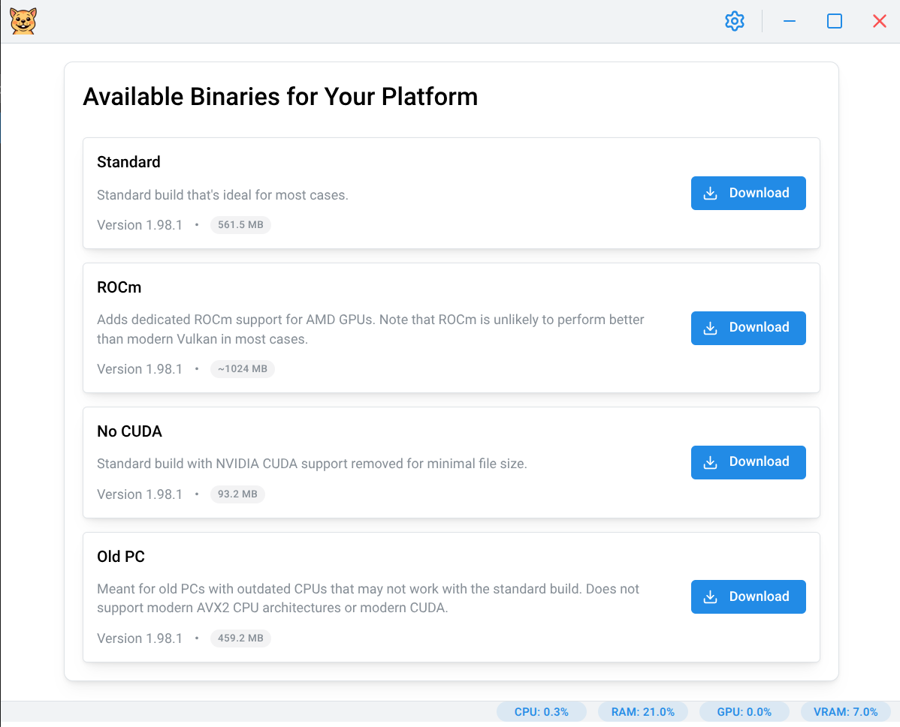
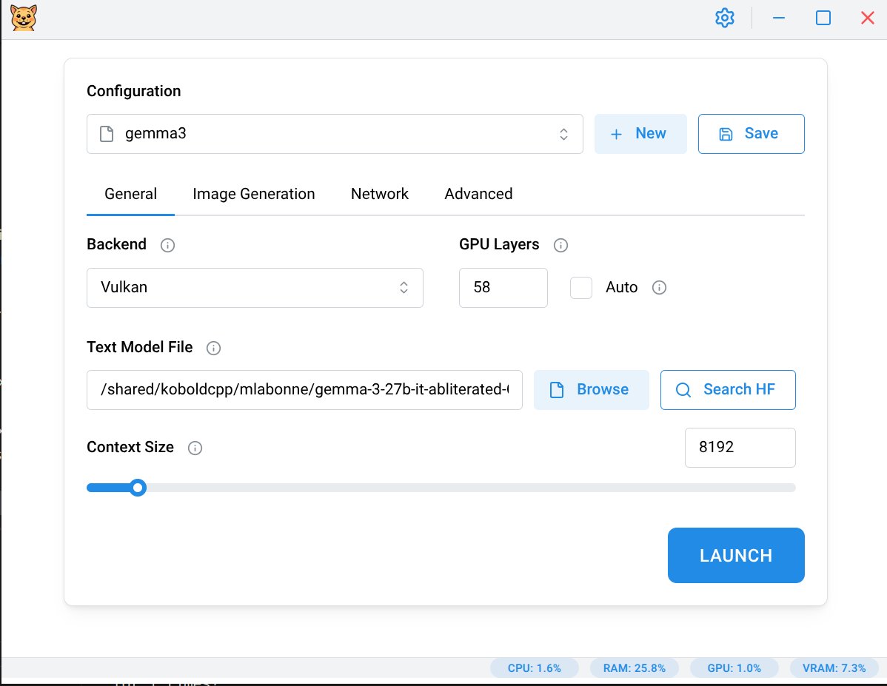
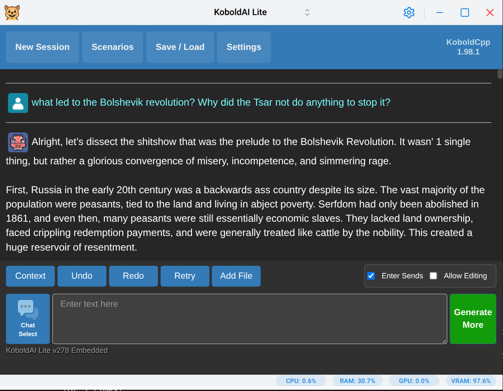
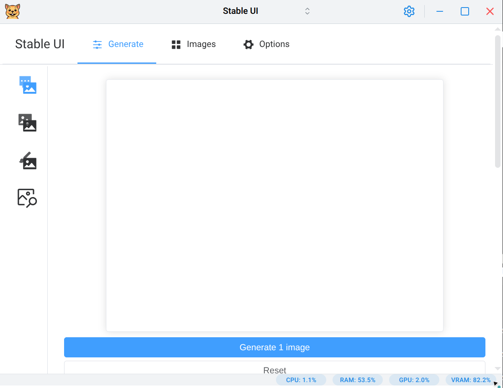
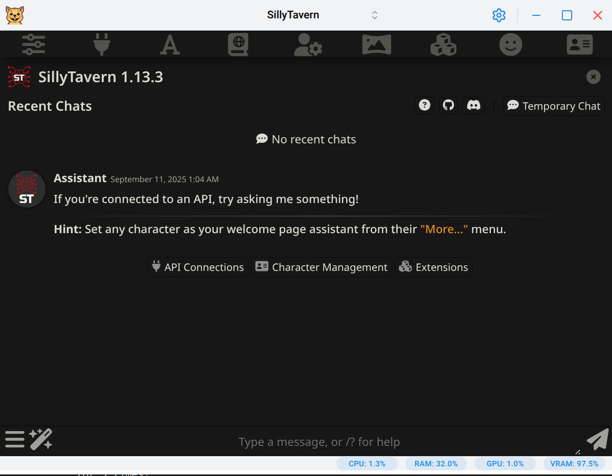
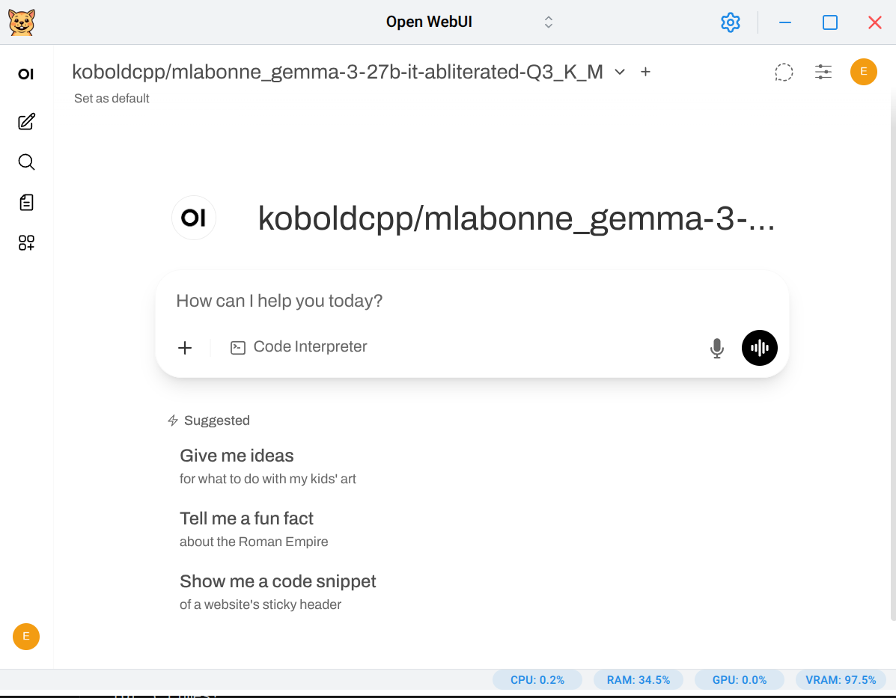

<div align="center">


# Gerbil

**The simplest way to run Large Language Models on your own hardware**

[](https://www.gnu.org/licenses/agpl-3.0)
[](https://github.com/lone-cloud/gerbil/releases)
[](https://github.com/lone-cloud/gerbil/stargazers)
[](https://aur.archlinux.org/packages/gerbil)

[Download](https://github.com/lone-cloud/gerbil/releases/latest) • [Features](#features) • [Screenshots](#demo--screenshots) • [Installation](#installation)

</div>

<!-- markdownlint-enable MD033 -->

Gerbil provides a graphical interface for running Large Language Models locally. It handles the technical complexity of managing backends, model downloads, and hardware acceleration - letting you focus on using AI rather than configuring it.

## Features

- **Run LLMs locally** - Powered by [KoboldCpp](https://github.com/LostRuins/koboldcpp), a fork of [llama.cpp](https://github.com/ggml-org/llama.cpp)
- **Cross-platform** - Native support for Windows, macOS, and Linux (including Wayland)
- **Offline capable** - Import pre-downloaded KoboldCpp binaries and run entirely without an internet connection
- **Flexible hardware support** - Works on CPU-only systems while also supporting GPU acceleration (CUDA, ROCm, Vulkan, CLBlast, Metal)
- **Image generation** - Built-in presets for Flux, Chroma, Qwen Image, and Z-Image workflows
- **Integrated HuggingFace search** - Browse models, view model cards, and download GGUF files directly from the app
- **SillyTavern integration** - Launch SillyTavern for advanced character interactions (requires [Node.js](https://nodejs.org/))
- **OpenWebUI integration** - Launch OpenWebUI for a modern web-based chat interface (requires [uv](https://docs.astral.sh/uv/getting-started/installation/))
- **Privacy-focused** - Everything runs locally with no external data transmission or telemetry

## Quick Start

1. **[Download Gerbil](https://github.com/lone-cloud/gerbil/releases/latest)** for your platform
2. **Launch the app** - No installation needed for portable versions
3. **Download a model** - Use the default model, use the built-in HuggingFace search by clicking on the looking glass icon, or import your own
4. **Start generating** - Text and image generation is supported

## Installation

### Pre-built Binaries

Download the latest release from the [GitHub Releases page](https://github.com/lone-cloud/gerbil/releases/latest):

- **Windows**: `Gerbil-Portable-X.X.X.exe` or `Gerbil-Setup-X.X.X.exe`
- **macOS**: `Gerbil-X.X.X.dmg`
- **Linux**: `Gerbil-X.X.X.AppImage`

### Linux - AUR (Arch Linux)

**Recommended for Arch users** - Automatic updates through your package manager:

```bash
# Using yay
yay -S gerbil

# Using paru
paru -S gerbil

# Manual installation
git clone https://aur.archlinux.org/gerbil.git
cd gerbil
makepkg -si
```

The AUR package handles desktop integration and keeps Gerbil updated with your system.

### macOS Security Note

After installing on macOS, you will notice that the app will not run as it was not verified by Apple. You will need to [follow these instructions](https://support.apple.com/en-ca/guide/mac-help/mh40616/mac) to remove it from your system's quarantine to be able to run it. Alternatively you can run `xattr -r -d com.apple.quarantine /Applications/Gerbil.app` in the terminal.

## Demo & Screenshots

https://github.com/user-attachments/assets/9e7ecfb3-3576-443c-8cef-a14e06ab5b60

<!-- markdownlint-disable MD033 MD022 -->

<table>
<tr>
<td width="50%">

### Download & Setup



</td>
<td width="50%">

### Model Launch Configuration



</td>
</tr>
<tr>
<td width="50%">

### Text Generation



</td>
<td width="50%">

### Image Generation



</td>
</tr>
<tr>
<td width="50%">

### SillyTavern integration



</td>
<td width="50%">

### OpenWebUI integration



</td>
</tr>
</table>

<!-- markdownlint-enable MD033 MD022 -->

## CLI Mode

The `--cli` argument allows you to run Gerbil in the terminal without the UI. This will run the same backend that the GUI was using.

### CLI Arguments

Gerbil supports the following command-line arguments:

- `--version` - Display the Gerbil version and exit
- `--cli` - Run in CLI mode
- `--minimized` - Start Gerbil GUI minimized to system tray (requires system tray to be enabled in settings)

### Considerations

You might want to run CLI Mode if you're looking to use a different frontend, such as OpenWebUI, than the ones bundled (eg. KoboldAI Lite, llama.cpp, Stable UI) with KoboldCpp AND you're looking to minimize any resource utilization of this app. Note that at the time of this writing, Gerbil only takes about ~200MB of RAM and ~100MB of VRAM for its Chromium-based UI. When running in CLI Mode, Gerbil will still take about 1/3 of those RAM and VRAM numbers.

### Usage

**Linux/macOS:**

```bash
# Basic usage - launch the KoboldCpp launcher with no arguments
gerbil --cli

# Pass arguments to the backend
gerbil --cli --help
gerbil --cli --port 5001 --model /path/to/model.gguf

# Any backend arguments are supported
gerbil --cli --model /path/to/model.gguf --port 5001 --host 0.0.0.0 --multiuser 2

# CLI inception (Gerbil CLI calling KoboldCpp CLI mode)
# This is the ideal way to run a custom frontend
gerbil --cli --cli --model /path/to/model.gguf --gpulayers 57 --contextsize 8192 --port 5001 --multiuser 1 --flashattention --usemmap --usevulkan
```

**Windows:**

CLI mode will only work correctly on Windows if you install Gerbil using the Setup.exe from the github releases. Otherwise there is currently a technical limitation with the Windows portable .exe which will cause it to not display the terminal output correctly nor will it be killable through the standard terminal (Ctrl+C) commands.

You can use the CLI mode on Windows in exactly the same way as in the Linux/macOS examples above, except you'll be calling the "Gerbil.exe". Note that it will not be on your system PATH by default, so you'll need to manually specify the full path to it when calling it from the Windows terminal.

## Local Dev

### Prerequisites

- **[fnm](https://github.com/Schniz/fnm)** - Fast Node.js version manager (installs correct Node.js versions automatically)

### Setup

1. **Install fnm** (if not already installed):

   ```bash
   # Using package manager (recommended for Arch Linux)
   yay -S fnm-bin

   # Or using curl (other distros)
   curl -fsSL https://fnm.vercel.app/install | bash
   ```

2. Clone the repository
3. Install Node.js and dependencies:

   ```bash
   # fnm will auto-install Node.js based on .nvmrc or engines field
   fnm use --install-if-missing
   npm install -g yarn
   yarn
   ```

4. Start the development server:

   ```bash
   yarn dev
   ```

## My Setup

- OS: [Archlinux](https://archlinux.org/) + KDE + Wayland
- Gerbil: installed from [AUR](https://aur.archlinux.org/packages/gerbil) via [yay](https://github.com/Jguer/yay)
- Backend: nocuda running the Vulkan acceleration
- Hardware: RX 7900 GRE (16GB VRAM, undervolted, overclocked), Ryzen 7 7800X3D, ASUS B650-E, 32GB RAM (EXPO 1: 6000Mhz)
- LLM: [Q4 Gemma 3 27b abliterated](https://huggingface.co/mlabonne/gemma-3-27b-it-abliterated-GGUF?show_file_info=gemma-3-27b-it-abliterated.q4_k_m.gguf)+ [Open WebUI](https://openwebui.com/) + [Dolphin system message](https://github.com/QuixiAI/dolphin-system-messages)

## Known Issues

- **Windows ROCm**: Requires manual PATH configuration. The ROCm bin directory (containing `hipInfo.exe`) must be added to your system PATH.

## Support This Project

If Gerbil makes your life easier, consider:

- **Starring this repo** - Helps others discover the project
- **Spreading the word** - Share with friends who want to try local AI
- **Reporting bugs** - Makes Gerbil better for everyone
